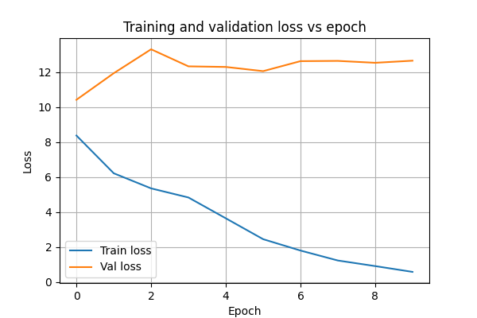

This project implements a from-scratch, GPT-2–style language model in PyTorch and trains it on a small custom text corpus. It is designed as a learning project to deeply understand each component of the GPT-2 architecture and the full training and generation pipeline.

***

## Project Overview

- Reimplements a GPT‑2–like Transformer decoder:
    - Token embeddings and positional embeddings
    - Stacked Transformer blocks with causal multi‑head self‑attention
    - Feed‑forward (MLP) sublayers with GELU activation
    - Layer normalization and residual connections
    - Final linear projection to vocabulary logits
- Uses the official GPT‑2 tokenizer via `tiktoken` to convert raw text to token IDs.
- Trains the model on a text file (`data/the-verdict.txt`) with a next‑token prediction objective (language modeling).
- Includes simple text generation utilities to sample continuations from a given prompt.

***

## Conda Environment Setup

Create and activate the conda environment from the project root:

```bash
conda env create -f environment.yml
conda activate mini-gpt2
```

You can adjust the PyTorch install (e.g., GPU build) according to your system.

***

## Model Architecture

The notebook builds a minimal GPT‑2–like model, closely mirroring the original 124M configuration (reduced context length for compute):

- **Tokenizer**: GPT‑2 BPE tokenizer via `tiktoken` (`vocab_size = 50257`).
- **Embeddings**:
    - `token_embedding`: maps token IDs to vectors of size `emb_dim`.
    - `pos_embedding_layer`: learnable positional embeddings up to `context_length`.
- **Transformer block** (repeated `n_layers` times):
    - Pre‑LayerNorm → Multi‑Head causal self‑attention → dropout → residual add.
    - Pre‑LayerNorm → Feed‑Forward (MLP: `emb_dim → 4*emb_dim → emb_dim`) with GELU → dropout → residual add.
- **Output layer**:
    - Final LayerNorm.
    - Linear projection from `emb_dim` back to `vocab_size` logits.

The training objective is standard cross‑entropy over the logits to predict the next token in the sequence.

***

## Training and Results

The model is trained on sliding windows of tokenized text with a stride equal to the sequence length (no overlap), using an AdamW optimizer. During training, the notebook periodically:

- Evaluates training and validation loss on a subset of batches.
- Generates a short text continuation from a fixed prompt.

A loss curve is saved to `results/loss_plot.png`, showing how training and validation loss evolve over epochs:



Example training log snippet (training progress and generated sample):

```text
Epoch 1/10, Step 5, Train loss: 8.4836, Val loss: 8.5877
Every effort moves you  the the the the.                                             
Epoch 2/10, Step 5, Train loss: 6.4167, Val loss: 6.6966
Every effort moves you .                                                 
Epoch 3/10, Step 5, Train loss: 5.8078, Val loss: 6.5190
Every effort moves you  I had"""""""""""""""""""I""""""""""""""""""""""""""""
Epoch 4/10, Step 5, Train loss: 5.4392, Val loss: 6.6558
Every effort moves you  of the to the of the of the to the of the of the of the of the of the, the to the                          
Epoch 5/10, Step 5, Train loss: 4.7113, Val loss: 6.2913
Every effort moves you  I had been.      "I. I had a--and, and I had the first.   "I, and the first, and I had the first, and, and the first. "I
Epoch 6/10, Step 5, Train loss: 3.8376, Val loss: 6.2245
Every effort moves you  I had been.      "I. Gisburn. Gisburn, and I had been. I had been. "Oh, and I had been. I had been, and as a little a little the
Epoch 7/10, Step 5, Train loss: 3.5262, Val loss: 6.1612
Every effort moves you  know the donkey, and I saw that he was his tone.  "--as, and I looked.  "I turned, and threw back his head to have to have to have to the donkey, and I had been. 
Epoch 8/10, Step 5, Train loss: 2.4233, Val loss: 6.1943
Every effort moves you  know, with a a little wild--I had the fact that, with a flash that, with a little the fact, with a, with the, with a later day, I had the first, the donkey, and were, with the picture
Epoch 9/10, Step 5, Train loss: 1.6192, Val loss: 6.2045
Every effort moves you ?"  "Yes--quite insensible to the fact that, and in the house."         "I turned back his head to the donkey again. I saw that, and as he said, I couldn
Epoch 10/10, Step 5, Train loss: 1.1915, Val loss: 6.2900
Every effort moves you ?"  "Yes--quite insensible to the irony. She wanted him. Gisburn's an awful simpleton, I had been the height of his head to look up at the sketch of the donkey. "There were days when I
```

This illustrates how the model initially produces very repetitive or degenerate outputs, then gradually learns more coherent continuations as training proceeds.

***

## Text Generation Example

The notebook includes simple helper functions:

- `text_to_token_ids(text, tokenizer=None, add_batch_dim=True)`
- `generate_text_simple(model, batch, n_tokens, max_context)`
- `token_ids_to_text(token_ids, tokenizer=None)`

Example usage in a Python cell:

```python
input_text = "My name is "

batch = text_to_token_ids(input_text)
batch = batch.to(device)

generated_tokens = generate_text_simple(model, batch, n_tokens=10, max_context=256)
generated_text = token_ids_to_text(generated_tokens)

print(input_text + generated_text)
```

This will print a continuation of the prompt `"My name is "` generated by the trained GPT‑2–style model.

```python
My name is   thought Jack Gisburn rather a cheap genius--
```

***

## What This Project Demonstrates

By rebuilding GPT‑2 at a small scale, this project provides a practical, end‑to‑end understanding of:

- How text is tokenized into subword units and batched for training.
- How a Transformer decoder is structured: attention heads, positional embeddings, feed‑forward layers, layer normalization, and residual connections.
- How next‑token prediction training works, including loss computation, optimization, and evaluation.
- How autoregressive generation produces text by repeatedly sampling the next token from the model.

Overall, implementing and training this mini GPT‑2 model from scratch yields a solid, hands‑on understanding of the GPT‑2 architecture and how modern language models are built and used in practice.
